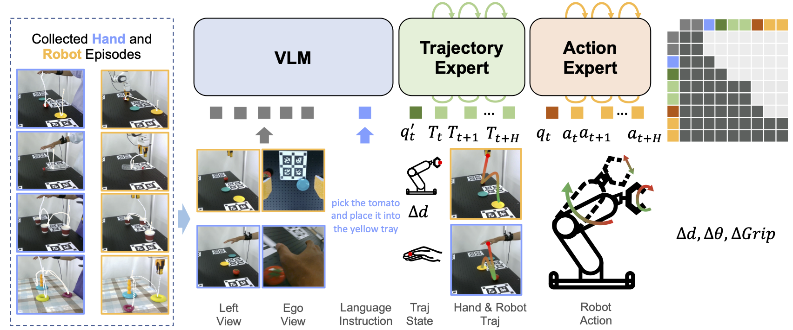

## From Human Hands to Robot Arms: Manipulation Skills Transfer via Trajectory Alignment

<div align="center">
    <a href="https://anonymous.4open.science/w/Traj2Action-4A45/"></a> &ensp;
  <a href="https://anonymous.4open.science/w/Traj2Action-4A45/#evaluation_videos"></a> &ensp;
  <a href="https://huggingface.co/datasets/Traj2Action/FruitsAndTray"></a> &ensp;
</div>



This repo contains training & evaluation code for the paper "From Human Hands to Robot Arms: Manipulation Skills Transfer via Trajectory Alignment". 

## 🔔 News
* 🔥 [2025-09]: We release our code, come and check it out!

## Introduction
We present **Traj2Action**, a novel framework that transfers human manipulation skills to robot arms by aligning human hand trajectories with robot end-effector trajectories. Our approach leverages a trajectory alignment model to map human hand movements to robot actions, enabling robots to perform complex manipulation tasks demonstrated by humans. We validate our method on a variety of tasks, showing significant improvements in task success rates and generalization to unseen scenarios.


## How to use

The codebase includes three main modules:
1. **Dataset Conversion and Preparation**: Tools to convert raw data into the LeRobot format, preprocess it, and organize it for efficient loading during training. See `dataset/README.md` for details.
2. **Policy Training and Serving**: A PyTorch-based codebase for learning and serving robot policies, supporting offline training on LeRobot-style datasets, PI0-style policy variants, and real-robot evaluation via a WebSocket policy server. See `policy/README.md` for details.
3. **Robot Control Library**: A library for controlling a Franka Emika Panda robot, including components for robot control, camera management, robot/hand data collection, and task execution. See `robot/README.md` for details.

For a typical workflow, start with dataset conversion and preparation, then proceed to policy training and serving, and finally use the robot control library for real-world robot manipulation tasks. You should follow the instructions in each module's README for setup and usage.

## Main Results
Please visit our [website](https://anonymous.4open.science/w/Traj2Action-4A45/#results) for the main results and evaluation videos.

## Contact
During the review process, we will keep anonymous.

## Citation
```tex
@inproceedings{,
  title={From Human Hands to Robot Arms: Manipulation Skills Transfer via Trajectory Alignment},
  author={},
  booktitle={},
  pages={},
  year={2026}
}
```