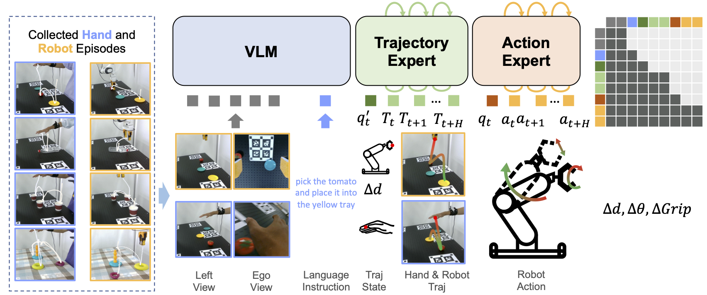
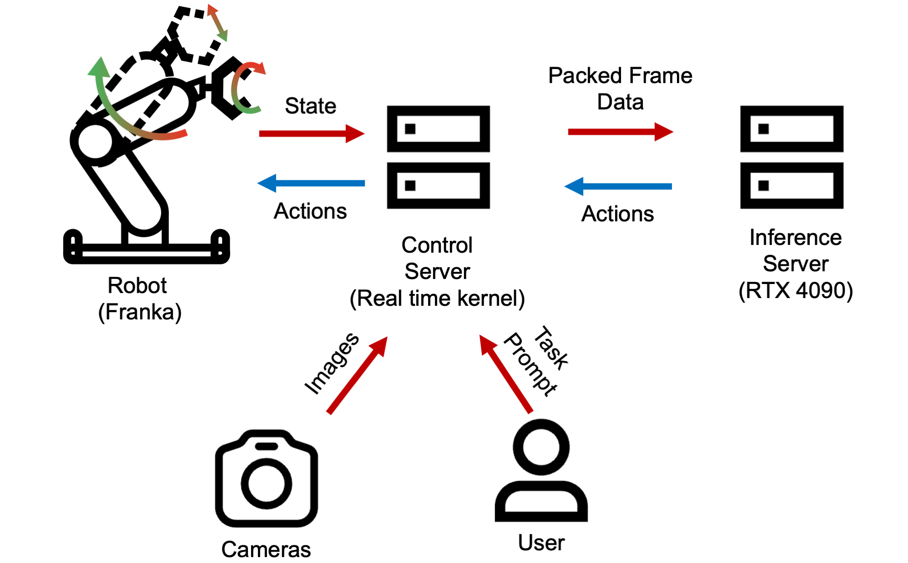

<p align="center">
  <h1 align="center"><strong>Traj2Action: A Co-Denoising Framework for Trajectory-Guided Human-to-Robot Skill Transfer</strong></h1>
  <p align="center">
    <a href="https://www.micdz.cn">Han Zhou</a><sup>1,3,*</sup>, <a href="https://scholar.google.com/citations?user=zjN-amcAAAAJ&hl=zh-CN">Jinjin Cao</a><sup>1,2,*</sup>, <a href="https://mlyarthur.github.io/">Liyuan Ma</a><sup>1,4,†</sup>, <a href="https://xuejifang.github.io/">Xueji Fang</a><sup>1,2</sup>, <a href="https://www.westlake.edu.cn/faculty/guojun-qi.html">Guo-jun Qi</a><sup>1,4</sup>
    <br>
    <sup>1</sup>MAPLE Lab, Westlake University, <sup>2</sup>Zhejiang University, <br><sup>3</sup>Huazhong University of Science and Technology, <br><sup>4</sup>Institute of Advanced Technology, Westlake Institute for Advanced Study,
    <br>
    <sup>*</sup>Equal contribution,
    <sup>†</sup>Corresponding author
    <br>
  </p>

  <p align="center"><strong>In Submission</strong></p>
</p>




This repo contains training & evaluation code for the paper "Traj2Action: A Co-Denoising Framework for Trajectory-Guided Human-to-Robot Skill Transfer". 

## 🔔 News
* 🔥 [2025-10-02]: We release our dataset.
* 🔥 [2025-09-30]: We release our code, come and check it out!

## Introduction
We present **Traj2Action**, a novel framework that transfers human manipulation skills to robot arms by aligning human hand trajectories with robot end-effector trajectories. Our approach leverages a trajectory alignment model to map human hand movements to robot actions, enabling robots to perform complex manipulation tasks demonstrated by humans. We validate our method on a variety of tasks, showing significant improvements in task success rates and generalization to unseen scenarios.


## How to use

The codebase includes three main modules:
1. **Dataset Conversion and Preparation**: Tools to convert raw data into the LeRobot format, preprocess it, and organize it for efficient loading during training. See `dataset/README.md` for details.
2. **Policy Training and Serving**: A PyTorch-based codebase for learning and serving robot policies, supporting offline training on LeRobot-style datasets, PI0-style policy variants, and real-robot evaluation via a WebSocket policy server. See `policy/README.md` for details.
3. **Robot Control Library**: A library for controlling a Franka Emika Panda robot, including components for robot control, camera management, robot/hand data collection, and task execution. See `robot/README.md` for details.

For a typical workflow, start with dataset conversion and preparation, then proceed to policy training and serving, and finally use the robot control library for real-world robot manipulation tasks. You should follow the instructions in each module's README for setup and usage.


## Main Results
Please visit our [website](https://micdz.github.io/Traj2Action) for the main results and evaluation videos.

## Contact
Han Zhou: [hanzhou04@outlook.com](mailto:hanzhou04@outlook.com)

Jinjin Cao: [caojinjin@westlake.edu.cn](mailto:caojinjin@westlake.edu.cn)

Liyuan Ma: [maliyuan@westlake.edu.cn](mailto:maliyuan@westlake.edu.cn)

## Citation
```tex
@misc{zhou2026traj2actioncodenoisingframeworktrajectoryguided,
      title={Traj2Action: A Co-Denoising Framework for Trajectory-Guided Human-to-Robot Skill Transfer}, 
      author={Han Zhou and Jinjin Cao and Liyuan Ma and Xueji Fang and Guo-jun Qi},
      year={2026},
      eprint={2510.00491},
      archivePrefix={arXiv},
      primaryClass={cs.RO},
      url={https://arxiv.org/abs/2510.00491}, 
}
```